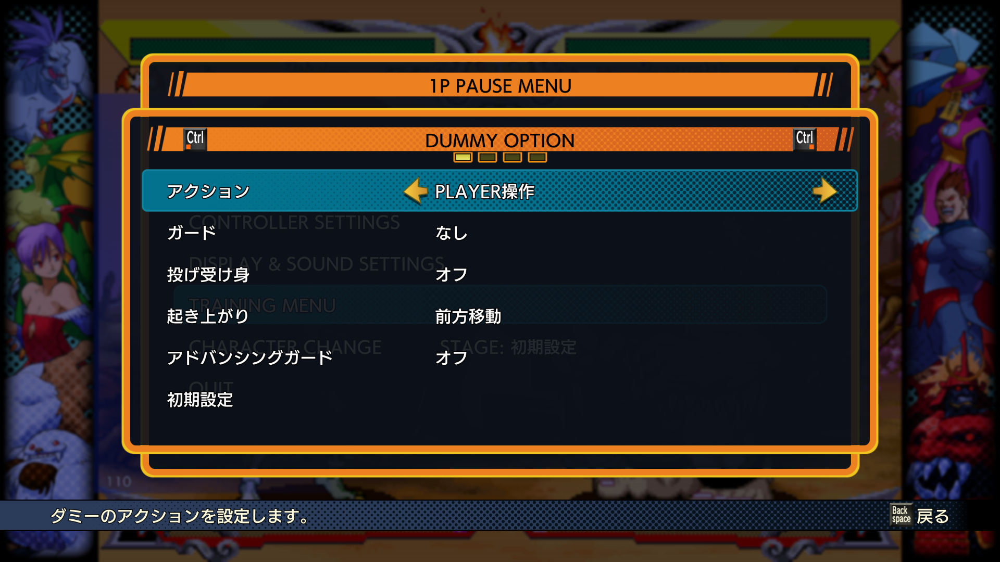
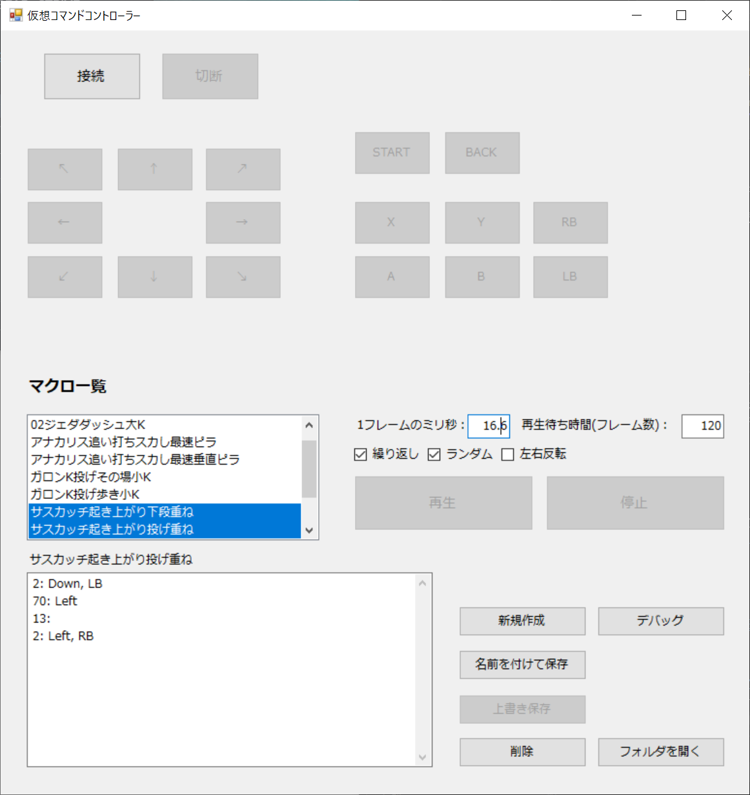
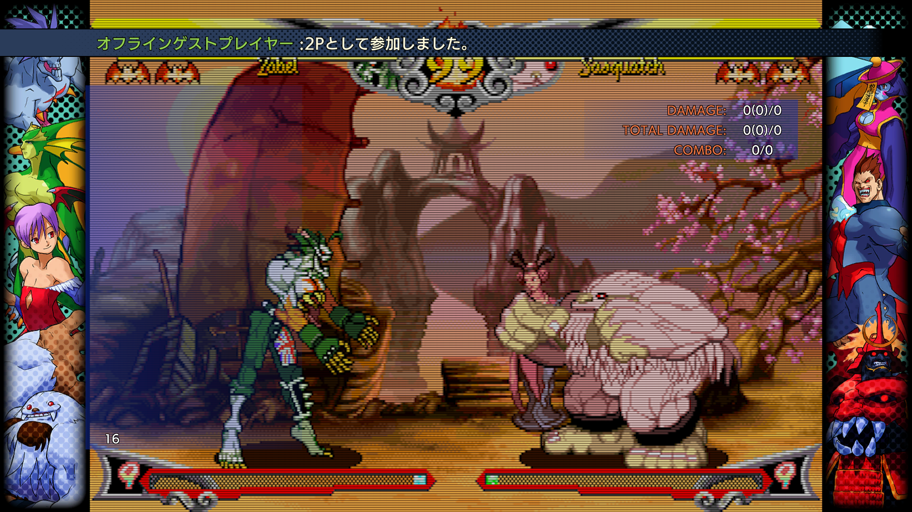
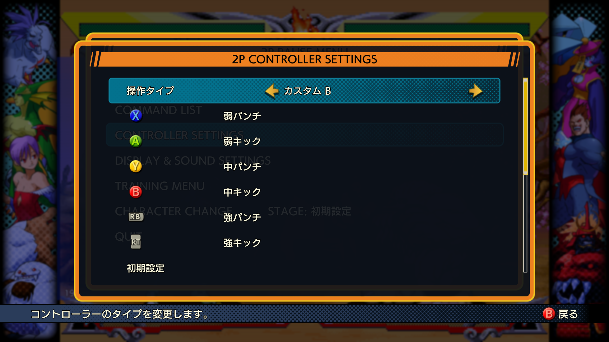
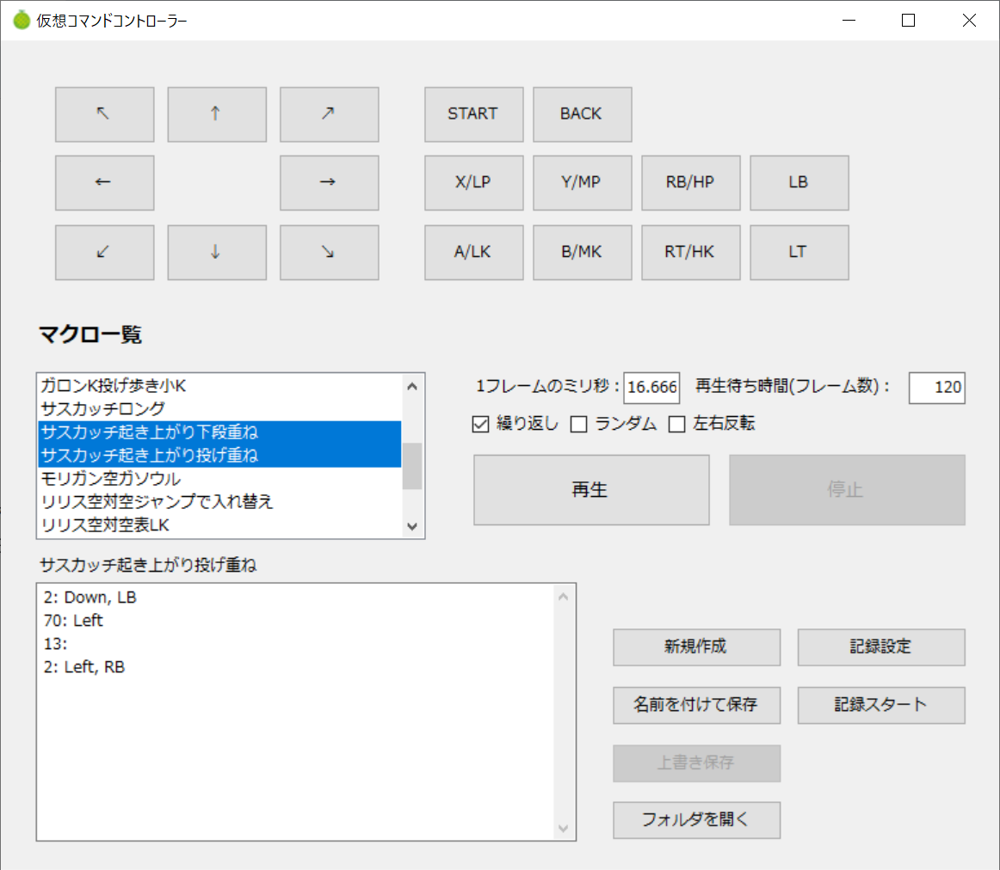
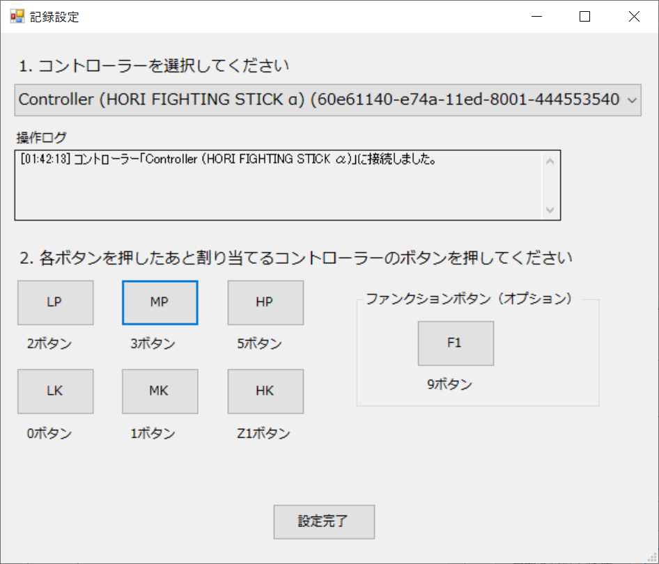

# 仮想コマンドコントローラー

## 概要
仮想コマンドコントローラーは、PC上で仮想Xbox 360コントローラーを操作し、マクロ再生やボタン入力を自動化できるWindowsアプリケーションです。

Steam版のファイコレ等のトレモ機能を補完するために作成しました。作者はヴァンパイアセイヴァーで利用していますが、他のゲームにも応用は可能かと思います（理論上はコントローラーを使うものなら何でも）。

ただし、自分用に作成したものなので、かなり適当な部分もあり、あまり細かいサポートや対応は期待しないでください。ご自身で試してみて、使える方に利用を推奨します。

---

## 利用条件

ヴァンパイアセイヴァーをやりましょう（推奨）

---

## 主な機能

- マクロファイルによるコントローラー操作の自動再生
- マクロ編集・保存・削除
- 複数マクロの管理・選択
- UIからの手動ボタン・スティック操作
- マクロ再生時の繰り返し・ランダム再生・待機フレーム指定
- 設定の保存・復元（フレーム速度、待機、選択マクロ等）
- マクロ記録機能
- マクロ条件付き再生機能

---

## 必要環境

- Windows 10/11
- .NET Framework 4.8（Windowsにデフォルトでインストールされている）
- [ViGEmBus](https://github.com/nefarius/ViGEmBus/releases/tag/v1.21.442.0) ドライバ（仮想コントローラー用）

---

## インストール方法

1. [ViGEmBus](https://github.com/nefarius/ViGEmBus/releases/tag/v1.21.442.0)ドライバをインストールしてください。
`ViGEmBus_1.21.442_x64_x86_arm64.exe` をダウンロードしてインストーラーを実行します。
2. 仮想コマンドコントローラーを[こちら](https://github.com/pikotea/VirtualController/releases/latest)からダウンロードして解凍します。
3. 解凍したフォルダ内の `VirtualController.exe` を実行します。

---

## 基本的な使い方

1. ゲームをトレーニングモードで起動し、「DUMMY OPTION」にて「アクション」を「PLAYER操作」にします。


2. 仮想コマンドコントローラーを起動します。


3. 画面上部のコントローラーUIで、ボタンや方向キーなどを操作するとゲーム内で正常に接続されたアナウンスが出ます。


4. 画面上部のコントローラーUIで、「BACK」ボタンを押して「CONTROLLER SETTINGS」を開きボタンを割り当ててください。

※コントローラーUI通りに設定するとわかりやすいと思います（LT、RTボタンは使えません）


5. あとは適当にマクロファイルを作成し、マクロを選択して「再生」ボタンを押すとマクロが実行されます。ランダム再生したい場合は複数選択し、「ランダム」にチェックを入れて「再生」
ボタンを押してください。


---

## マクロの作成方法

手動で作成する方法と、マクロ記録機能を使う方法があります。マクロ記録機能を使ってベースを作成し、手動で微調整するのが楽かと思います。

1. 画面右下の「記録設定」ボタンを押すと、記録設定画面が開きます。


2. 記録設定画面の案内に従って、別のコントローラーを選択して、各種ボタンを割り当ててください。
※F1キーは、トレモの位置リセットボタンを割り当てると便利です。

3. 設定が終わったら、「記録スタート」ボタンを押し、ゲームに戻って設定したコントローラーで操作してください。再度ボタンを押すと記録が停止します。

## マクロファイル仕様

- 1行ごとにフレーム数と操作キーを記述  
  例: `3:UP,A` （3フレームUPとAボタンON）
- 複数キーはカンマ区切り
- キーは以下の形式で指定可能（大文字・小文字区別なし）
  - ボタン: A, B, X, Y, LB, RB
  - ボタン: LP, LK, MP, MK, HP, HKでも可です（A=LP, B=MP, X=HP, Y=LK, RB=MK, LB=HK）
  - 方向: UP, DOWN, LEFT, RIGHT
- 待ちフレームはキーを書かなければOK
  例: `5:` （5フレーム待機）
- `#`から始まる行はコメントとして無視されます（行末コメントは非対応です）
- ゲーム内のフレームと同期しているわけではないので、1フレームで定義すると認識されない場合があるので、2フレーム以上で指定することを推奨します。
- 現状はマクロの作成は非常に面倒です。前後1フレームずれることを意識しつつ、うまく動くかどうか試行錯誤してください（フレームの知識も必要です）。
- 特殊な仕様としてトリガー機能があります。次のセクションで詳しく説明します。

例）サスカッチの大足でダウンさせて起き上がりに投げをするマクロ（キャラごとに起き上がりスピードが違うので待ちフレームは調整する必要があります。例はザベル相手）
```
2: Down, HK
70: Left
13:
2: Left, HP
```

---

## マクロファイル仕様（トリガー機能）β版

特定のキーをトリガーにしてマクロを再生することができます（この機能はβ版のため仕様が変更される可能性があります）。
マクロの先頭にコメントで `TRIGGER:`を追加してキーを指定します。

```
#TRIGGER: HK
40:
2: Left
2: Down
2: Down, Left, LP
```

このマクロは、プレイヤー側が大キックを押したら起き上がりに昇竜を出すというものです（フレームは適当）。


また、`TRIGGERWAIT:` でトリガー待機中にガードを入れておくこともできますので、ガード後に最速で技を出すといった使い方も可能です。

```
#TRIGGER: LP
#TRIGGERWAIT: Down, Right
10:
2: HP
```

応用として位置リセットボタンをトリガーにして、特定の位置からの行動を自動化することもできます。


例）左画面端にリセットしたらダミーは前ジャンプして位置を入れ替える
```
#TRIGGER: F1
2:
2: Up, Right
34:
20:Left
```

上記のマクロに以下のマクロを一緒に再生すると、位置リセット後に自動で前ジャンプして位置を入れ替え、ジャンプすると空対空が飛んできて裏周りしてきます。色々応用が効くと思うので頑張ってください。

```
#TRIGGER: UP
2: UP, Left
10:
2: LP
34:
8: Left
2: Down, LK
```

---


## FAQ

Q: 見た目がださいんですが？
A: 仕様です。

Q: 仮想コマンドコントローラーを触るとゲームが非アクティブになって操作できないのですが？
A: Steam入力が有効になっている可能性があります。Steam上のゲーム画面で「プレイ」ボタンの右端にでコントローラーのボタンがあるので、そこでSteam入力を無効にしてください。

Q: マクロファイルをコピーしたいのですが？
A: 編集中のマクロを名前を付けて保存するとコピーができます。大量のコピーを作りたい場合は、エクスプローラーで `macros` フォルダ内のファイルをコピーしてください。

Q: ちゃんとマクロ通りに動いているか確認したいのですが？
A: 仮想コマンドコントローラーから1Pで接続してゲームを開始すればキーログもでて動作確認できます。難しいコンボなんかも作れるはずなのでお試しください。

## 既知の問題

- マクロを編集後に保存せずに再生ボタンを押すと、自動で上書き保存するんですが、再生が止まってしまうのでそのままもう一回再生ボタンを押してください。
- 各種ボタンの有効、無効が正しく反映されない可能性があります。
- あとたぶん他にもたくさんバグがあるのでここにないバグは気が向いたら報告してください。

## 注意事項

- ゲームやアプリによっては仮想コントローラー入力が認識されない場合があります。
- ViGEmBusドライバが正しくインストールされていないと動作しません。
- ドライバの技術上の制約でLS, RSボタンは利用できません。

---

## ライセンス

本ソフトウェアはMITライセンスです。  
ViGEmBus（BSD-3-Clauseライセンス）を利用しています。  
詳細はLICENSEファイルを参照してください。

---

## 今後の予定（気が向いたらやります。やらない可能性もあり）

- 入力の正確性を計測する機能（AG入力が正しい順序、フレームで入力できているかなどを計る）

---

## 作者

デカメロン [@dekameron999](https://x.com/dekamelon999)
